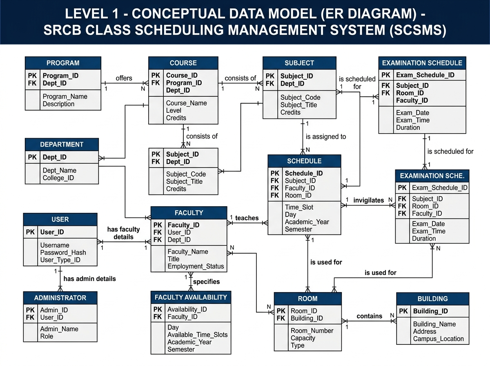

# St. Rita's College of Balingasag, Inc.
**Balingasag, Misamis Oriental**  
**Higher Education Department**  
**Information Technology Program**  

---

# SRCB Class Scheduling Management System (SCSMS): A Web-Based Class Scheduling and Management System

### Submitted By:
- **Achas, Jovann**
- **Banquerigo, Jake**
- **Llacuna, Randrei John C.**
- **Sabuero, Marco**

---

## I. System Name

**SRCB Class Scheduling Management System (SCSMS): A Web-Based Class Scheduling and Management System**

---

## II. Description of the System

The **SRCB Class Scheduling Management System (SCSMS)** is a comprehensive, web-based academic administration and timetable management platform engineered specifically for **St. Rita’s College of Balingasag (SRCB)**. The system modernizes and automates the institution's manual class and examination scheduling procedures by establishing a unified, centralized database for programs, courses, curriculum subjects, faculty members, teaching availability, campus buildings, classrooms/laboratories, class timetables, and examination schedules.

The platform implements strict **Role-Based Access Control (RBAC)** tailored to four institutional user roles:
1. **Super Admin (ICT Office):** Responsible for overarching platform governance, user lifecycle management (account creation, role delegation, credential management), account security, and account suspension enforcement.
2. **Admin (College Registrar / Scheduling Officer):** Holds comprehensive operational authority to configure academic years, semesters, programs, courses, year levels, sections, subjects, classrooms across campus buildings, faculty profiles, and to compose and validate institutional class and examination schedules.
3. **Program Head (Department Chairperson):** Exercises focused administrative authority over their assigned academic department (e.g., Information Technology, Business Administration, Criminology, Hospitality Management, Teacher Education), authoring and managing major subject schedules, assigning qualified instructors, monitoring faculty loading, and validating departmental room utilization.
4. **Teacher / Faculty:** Accesses a personalized faculty portal to view assigned class timetables, room assignments, subject details, teaching loads, and class modalities (Face-to-Face vs. Online). **Part-Time Teachers** and faculty with special institutional commitments are empowered to specify their exact available teaching days and time windows.

The system addresses the complexities of institutional timetable creation through an interactive scheduling interface paired with a **real-time Conflict Detection and Validation Engine**. As authorized users draft or modify class assignments, the system continuously audits scheduling matrices to prevent faculty time overlaps, classroom double-bookings, section time collisions, and faculty availability violations. 

To accommodate SRCB's multi-tier physical infrastructure, the system supports room allocations across the **College Building**, **Senior High School (SHS) Building**, and **Junior High School (JHS) Building**, managing specific facility classifications such as lecture halls, computer laboratories, science laboratories, and specialized learning spaces with predefined seating capacities. The system natively accommodates **dual instructional delivery modes**, distinguishing between **Face-to-Face** classes (which require dedicated physical room reservations) and **Online** classes (which bypass room constraints while reserving instructor and student cohort time slots). 

Furthermore, the system incorporates a specialized **Examination Scheduling Module**. This module coordinates Midterm and Final examination periods and supports **Common Examination Scheduling**, allowing multi-section cohorts taking identical subjects (e.g., General Education courses like *GE1 - Understanding the Self*) to sit for examinations simultaneously across designated examination rooms with assigned proctors, preventing the leakage or sharing of test items. The platform also delivers instant institutional reporting, including faculty workload summaries, classroom utilization statistics, master timetable sheets, and official data exports.

---

## III. Services

The system supports the following institutional services:

1. **User Account and Security Administration:**
   - Role-based user authentication and authorization (Super Admin, Admin, Program Head, Teacher).
   - Secure account provisioning, profile maintenance, and credential management.
   - Account suspension controls with instant session invalidation and suspension alert notifications.
2. **Academic Structure & Curriculum Management:**
   - Management of institutional academic programs, program majors, curriculum structures, and course offerings.
   - Configuration of degree year levels (1st Year to 4th/5th Year) and student section cohorts.
   - Subject cataloging with credit units, lecture hours, laboratory hours, prerequisite tracking, and department assignments.
3. **Faculty Directory and Availability Profiling:**
   - Faculty profile management with employment classification (Full-Time vs. Part-Time).
   - Dynamic faculty availability matrix capturing specific available days and time slots.
   - Accommodation of custom availability schedules for part-time lecturers and religious sister faculty.
4. **Campus Infrastructure and Facility Management:**
   - Building directory management spanning the College, SHS, and JHS facilities.
   - Room cataloging with room numbers, classifications (Lecture Room, Computer Laboratory, Science Laboratory, Faculty Room), operational status, and seating capacities.
5. **Interactive Class Timetable Scheduling:**
   - Visual, grid-based class scheduling across days of the week (Monday through Saturday) and time slots (7:00 AM to 9:00 PM).
   - Automated slot computation balancing lecture hours and laboratory hour requirements.
   - Manual drag-and-drop or slot-selection schedule creation with section color-coding.
6. **Real-Time Automated Conflict Detection Engine:**
   - Instant visual flagging of classroom double-booking conflicts.
   - Prevention of instructor overlapping assignments.
   - Detection of student section scheduling collisions.
   - Real-time validation against faculty availability windows.
7. **Dual-Modality Class Scheduling:**
   - Support for Face-to-Face class scheduling requiring physical room allocation.
   - Support for Online/Virtual class scheduling requiring no physical classroom assignment.
8. **Institutional Examination Schedule Management:**
   - Term-based exam schedule creation (Midterm and Final Examination terms).
   - Common examination coordination synchronizing exam dates and time slots for shared subjects across multiple sections.
   - Proctor assignment, examination room reservation, and multi-section room allocation.
9. **Academic Term Scoping and Transition:**
   - Academic Year and Semester activation and lifecycle management.
   - Active term filtering ensuring scheduling decisions apply strictly to the active semester.
10. **Institutional Workload & Utilization Reporting:**
    - Generation of faculty teaching workload reports (total units, contact hours, schedule breakdown).
    - Room utilization and occupancy analytics.
    - Master section timetable sheets, individual faculty schedules, and printer-friendly exports.

---

## IV. User Stories

The following user stories capture the core operational needs, constraints, and institutional requirements gathered during stakeholder interviews with **Sir Charls** on **July 29, 2026**, along with the follow-up systems analysis on **August 8, 2026**:

1. **Unique and Conflict-Free Schedules:**  
   *As Sir Charls (Academic Scheduler / Admin), I want to create conflict-free class schedules so that overlapping faculty assignments, room double-bookings, and section time collisions are completely prevented.*
2. **Dedicated Religious Sister Faculty Availability:**  
   *As Sir Charls, I need the system to honor custom faculty availability windows—specifically for institutional faculty like the religious Sister who teaches college subjects and is strictly available only from 7:00 AM to 10:00 AM—so that classes are never scheduled outside her available hours.*
3. **Part-Time Faculty Availability Management:**  
   *As Sir Charls, I want part-time faculty members to register their exact teaching days and times, and for the system to validate schedules against these constraints so that part-time instructors are only assigned classes when they are on campus.*
4. **Multi-Building Campus Room Allocation:**  
   *As Sir Charls, I need the system to support room assignments across multiple campus facilities (College Building, Senior High School Building, and Junior High School Building) so that college classes can utilize available rooms throughout the institution.*
5. **Class Delivery Modality (Face-to-Face vs. Online):**  
   *As Sir Charls, I want to clearly designate whether a scheduled class is Face-to-Face or Online, ensuring physical rooms are reserved solely for Face-to-Face classes while online classes do not tie up limited classroom inventory.*
6. **Common Examination Scheduling for Academic Integrity:**  
   *As Sir Charls (August 8, 2026 follow-up), I want to schedule common examination time slots for students enrolled in identical subjects (such as GE1 - Understanding the Self) on the same date and time across all sections, preventing the premature sharing of examination questions and answers.*
7. **Proctor and Examination Room Assignment:**  
   *As Sir Charls, I want to assign examination rooms, buildings, and proctors to examination schedules to ensure organized and well-supervised midterm and final examination periods.*
8. **Departmental Program Head Governance:**  
   *As a Program Head, I want to schedule major subjects, assign instructors, and monitor room allocations for my specific program so that departmental curricular requirements are properly administered.*
9. **Faculty Schedule Transparency:**  
   *As a Teacher / Faculty Member, I want to log into my portal to view my updated class schedule, assigned rooms, course loads, and exam proctoring duties from any device.*
10. **ICT Security and Account Governance:**  
    *As the ICT Super Admin, I want to manage all user accounts, assign roles, and immediately suspend compromised or inactive accounts with instant session lockout to preserve institutional data security.*

---

## V. Functionalities of the System

### Super Admin (ICT Office)
- **Account Provisioning:** Create and register new user accounts for Admins, Program Heads, and Teachers.
- **Account Modification:** Update user profiles, full names, email addresses, and role assignments.
- **Security & Status Governance:** Activate or suspend user accounts; suspended accounts are denied login privileges and active sessions are terminated immediately.
- **Password Administration:** Initiate administrative password resets and manage authentication credentials.
- **System Audit & Maintenance:** Monitor system user records and ensure adherence to institutional data policies.

### Admin (College Registrar / Scheduling Officer)
- **Academic Term Configuration:** Define and activate Academic Years (e.g., 2026–2027) and Semesters (1st Semester, 2nd Semester, Summer).
- **Curriculum & Program Management:** Create and maintain programs, program majors, courses, year levels (1st to 5th Year), and student sections.
- **Subject Catalog Management:** Register and update subjects, credit units, lecture hours, laboratory hours, and course descriptions.
- **Campus Facility Management:** Maintain campus buildings (College, SHS, JHS) and manage rooms, room types (Lecture, Lab, Faculty Room), seating capacities, and operational statuses.
- **Faculty Directory & Load Management:** Maintain the master faculty directory, classify employment statuses (Full-Time vs. Part-Time), and oversee faculty availability.
- **Comprehensive Class Scheduling:** Create, update, and delete class schedule blocks manually on an interactive calendar grid with real-time conflict checking.
- **Class Schedule Generator:** Utilize automated heuristic timetable generation to draft schedules respecting subject hours, room capacities, and teacher availability.
- **Examination Schedule Management:** Author and manage Midterm and Final examination schedules, group multiple sections for common subject exams, and assign proctors and examination rooms.
- **Institutional Reporting:** Generate, view, filter, print, and export faculty workload reports, room utilization summaries, and master timetable schedules.

### Program Head (Department Chairperson)
- **Departmental Dashboard:** View real-time scheduling statistics, faculty counts, and subject offerings for their designated program.
- **Major Subject Scheduling:** Author and manage schedules for major subjects belonging to their assigned program curriculum.
- **Faculty Assignment:** Assign qualified departmental faculty members to program course offerings.
- **Departmental Availability Review:** Inspect the availability matrix of faculty members within their department to ensure optimal scheduling.
- **Room & Schedule Monitoring:** Monitor classroom utilization and class schedules for all sections under their program.
- **Examination Schedule Viewing:** Review departmental examination timetables and proctor assignments.

### Teacher / Faculty (Full-Time & Part-Time)
- **Personalized Faculty Timetable:** View personal class schedules detailing subject codes, subject titles, assigned sections, days, and time slots.
- **Room & Modality Inspection:** View assigned physical room numbers, campus building locations, and instructional modes (Face-to-Face vs. Online).
- **Availability Submission (Part-Time & Constrained Faculty):** Register and adjust available teaching days and time intervals (e.g., specific morning/afternoon windows) for administrative review.
- **Examination Proctoring Schedule:** View scheduled examination proctoring assignments, examination dates, times, and assigned testing rooms.
- **Profile Management:** View personal account details and manage account credentials.

### System Automated Capabilities (Core Engine)
- **Real-Time Timetable Conflict Detection:**
  - *Room Collision Prevention:* Flags if a physical room is assigned to more than one class at the same day and overlapping time.
  - *Faculty Collision Prevention:* Flags if an instructor is scheduled to teach more than one class simultaneously.
  - *Section Collision Prevention:* Flags if a student section cohort is scheduled for two different classes at the same time.
  - *Availability Bounds Checking:* Flags if an instructor is scheduled outside their recorded available hours.
  - *Capacity Compliance Validation:* Warns if student section headcount exceeds room capacity.
- **Dual-Delivery Modality Handling:** Automatically bypasses room requirement checks when class modality is set to *Online*, while strictly enforcing physical room assignment when *Face-to-Face*.
- **Common Examination Slot Synchronization:** Coordinates common examination periods across multiple sections for identical subjects.
- **Active Term Scoping:** Automatically binds all scheduling operations and queries to the currently active Academic Year and Semester.
- **Authentication & Role Authorization Enforcement:** Protects REST API endpoints and UI views using JSON Web Tokens (JWT) and role-specific guards.

---

## VI. Conceptual Model

### Figure 1: The Level 1 Conceptual Model
*(Conceptual Data Model / Entity-Relationship Diagram for the SRCB Class Scheduling Management System)*



```
+----------------------------------------------------------------------------------------------------+
|                   LEVEL 1 - CONCEPTUAL DATA MODEL (ER DIAGRAM)                                     |
|                   SRCB CLASS SCHEDULING MANAGEMENT SYSTEM (SCSMS)                                  |
+----------------------------------------------------------------------------------------------------+

     +-----------------------+              +-----------------------+              +-----------------------+
     |        PROGRAM        | 1          N |        COURSE         | 1          N |        SUBJECT        |
     +-----------------------+--------------+-----------------------+--------------+-----------------------+
     | PK  Program_Code      |    offers    | PK  Course_Code       |   consists   | PK  Subject_Code      |
     |     Program_Name      |              | FK  Program_Code      |      of      | FK  Program_Code      |
     |     Description/Focus |              |     Course_Name       |              | FK  Semester_ID       |
     +-----------+-----------+              |     Year_Duration     |              |     Subject_Title     |
                 | 1                        +-----------+-----------+              |     Units             |
                 |                                      | 1                        |     Lecture_Hours     |
                 | has                                  | offers                   |     Laboratory_Hours  |
                 |                                      |                          +-------+-------+-------+
                 | N                                    | N                                | 1     | 1
     +-----------v-----------+              +-----------v-----------+                      |       | is scheduled
     |        FACULTY        | 1          N |        SECTION        |                      |       | for
     +-----------------------+--------------+-----------------------+                      |       |
     | PK  Faculty_ID        |  advises /   | PK  Section_ID        |                      |       | N
     | FK  Program_Code      |  assigned    | FK  Course_Code       |                      |   +---v-------------------+
     |     Employee_Number   |              | FK  Adviser_ID        |                      |   | EXAMINATION_SCHEDULE  |
     |     Full_Name         |              |     Year_Level        |                      |   +-----------------------+
     |     Email / Phone     |              |     Section_Label     |                      |   | PK  Exam_Schedule_ID  |
     |     Employment_Status |              |     Students_Count    |                      |   | FK  Subject_Code      |
     |     Faculty_Type      |              +-----------+-----------+                      |   | FK  Proctor_ID        |
     +---+-------+-------+---+                          | 1                                |   | FK  Room_Number       |
         | 1     | 1     | 1                            |                                  |   |     Term (Mid/Final)  |
         |       |       |                              | is scheduled                     |   |     Exam_Date         |
         |       |       | is assigned to               | in                               |   |     Start/End Time    |
         |       |       |                              |                                  |   |     Section_Names     |
         |       |       | N                            | N                                |   |     Building / Modality|
         |       |   +---v------------------------------v---+                              |   +-----------------------+
         |       |   |               SCHEDULE               |<-----------------------------+               |
         |       |   +--------------------------------------+                 is scheduled                 |
         |       |   | PK  Schedule_ID                      |                 in                           |
         |       |   | FK  Subject_Code                     |                                              |
         |       |   | FK  Faculty_ID                       |                                              |
         |       |   | FK  Section_ID                       |                                              |
         |       |   | FK  Room_Number                      |                                              |
         |       |   | FK  Semester_ID / Academic_Year_ID   |                                              |
         |       |   |     Day_Of_Week                      |                                              |
         |       |   |     Start_Time / End_Time            |                                              |
         |       |   |     Class_Mode (F2F / Online)        |                                              |
         |       |   |     Color                            |                                              |
         |       |   +------------------+-------------------+                                              |
         |       |                      | N                                                                |
         | has   | has                  |                                                                  |
         | acc.  | avail.               | uses                                                             |
         |       |                      |                                                                  |
         | 1     | N                    | 1                                                                | N
     +---v---+ +-v------------------+ +--v--------------------+ 1              N +-------------------------+
     | USER  | |FACULTY_AVAILABILITY| |        ROOM         +-----------------+        BUILDING         |
     +-------+-+--------------------+ +---------------------+    is located   +-------------------------+
     |PK User| |PK Availability_ID  | | PK  Room_Number     |    in           | PK  Building_ID/Name    |
     |FK Fac.| |FK Faculty_ID       | | FK  Building_Name   |                 |     Building_Name       |
     |Email  | |   Day_Of_Week      | |     Room_Name       |                 |     Building_Type       |
     |Role   | |   Start_Time       | |     Room_Type       |                 |     (College/SHS/JHS)   |
     |Status | |   End_Time         | |     Capacity        |                 +-------------------------+
     +-------+ |   Status           | |     Status          |
               +--------------------+ +---------------------+
```

### Narrative Description of the Conceptual Data Model

The **Level 1 Conceptual Model** depicts the structural entity architecture, attributes, key constraints, and relational associations governing the **SRCB Class Scheduling Management System (SCSMS)**. The model is centered around institutional integrity, ensuring class scheduling and examination coordination operate without resource collisions while accurately mapping physical campus resources to academic requirements.

1. **Academic Hierarchy (`PROGRAM`, `COURSE`, `SECTION`, `SUBJECT`):**
   - An academic **Program** (e.g., Information Technology) represents a degree-granting division. Each Program offers one or more **Courses** (e.g., Bachelor of Science in Information Technology).
   - Each **Course** spans multiple Year Levels (1st Year to 4th/5th Year) and contains multiple **Sections** (e.g., BSIT-1A, BSIT-2A). Sections capture the exact student headcount (`Students_Count`) and are assigned an advisory faculty member (`Adviser_ID`).
   - A Program curates a catalog of curriculum **Subjects**. Each Subject specifies its credit units, required weekly lecture hours (`Lecture_Hours`), laboratory hours (`Laboratory_Hours`), and active semester assignment.

2. **Instructional Personnel & Availability (`FACULTY`, `USER`, `FACULTY_AVAILABILITY`):**
   - The **Faculty** entity captures institutional instructors, storing full name, contact information, employment status (*Full-Time* vs. *Part-Time*), position, and departmental affiliation.
   - Each Faculty member may correspond to a **User** account in the system with an assigned role (`super_admin`, `admin`, `program_head`, `teacher`) and active status (`Active` vs. `Suspended`).
   - A Faculty member has one or more **Faculty Availability** records. This entity tracks the specific days of the week and time windows (Start Time to End Time) when the instructor is available for instructional duties. This models part-time faculty contracts as well as specific religious sister availability constraints (e.g., 7:00 AM – 10:00 AM).

3. **Physical Campus Infrastructure (`BUILDING`, `ROOM`):**
   - The **Building** entity models physical structures on campus across the **College Building**, **Senior High School (SHS) Building**, and **Junior High School (JHS) Building**.
   - Each Building contains multiple **Rooms**. A Room possesses a unique room identifier/number, descriptive name, facility classification (`Lecture Room`, `Computer Laboratory`, `Science Laboratory`, `Faculty Room`), maximum seating capacity, and operational status (`Available`, `Maintenance`).

4. **Timetable Coordination (`SCHEDULE`, `ACADEMIC_YEAR`, `SEMESTER`):**
   - The central operational entity is the **Schedule**. A Schedule record links a **Subject**, a student **Section**, an assigned **Faculty** member, and an allocated **Room** during a specific **Day of the Week** between a defined **Start Time** and **End Time**, scoped to an active **Semester** and **Academic Year**.
   - To support flexible delivery, each Schedule specifies a **Class Mode** (*Face-to-Face* or *Online*). Face-to-Face classes maintain a foreign key reference to a physical Room, while Online classes allow the room reference to be null, freeing physical facilities while booking instructor and student time slots.

5. **Examination Coordination (`EXAMINATION_SCHEDULE`):**
   - The **Examination Schedule** entity coordinates institutional Midterm and Final examinations.
   - Each record associates a **Subject**, an examination room (**Room**), an assigned proctor (**Faculty**), an **Exam Date**, and designated **Start and End Times**.
   - The model supports **Common Examination Scheduling**: multiple student sections enrolled in the same subject (e.g., *GE1*) are grouped (`Section_Names`) and scheduled simultaneously on the same date and time slot across allocated examination halls to uphold testing confidentiality and prevent exam compromise.

---

### Entity Relationship Specifications and Cardinalities

| Parent Entity | Relationship | Child Entity | Cardinality | Business Description |
| :--- | :---: | :--- | :---: | :--- |
| **PROGRAM** | offers | **COURSE** | 1 : N | One program offers one or many curriculum courses/majors. |
| **PROGRAM** | employs | **FACULTY** | 1 : N | One program employs one or many faculty members. |
| **COURSE** | organizes | **SECTION** | 1 : N | One course organizes multiple student section cohorts across year levels. |
| **PROGRAM** | catalogs | **SUBJECT** | 1 : N | One program establishes one or many academic subjects. |
| **FACULTY** | has account | **USER** | 1 : 1 | A faculty member corresponds to a single authenticated user account. |
| **FACULTY** | registers | **FACULTY_AVAILABILITY** | 1 : N | A faculty member registers one or many weekly availability time windows. |
| **BUILDING** | houses | **ROOM** | 1 : N | One campus building contains one or many rooms or laboratories. |
| **FACULTY** | teaches | **SCHEDULE** | 1 : N | A faculty member is assigned to teach one or many weekly class schedule slots. |
| **SECTION** | attends | **SCHEDULE** | 1 : N | A section cohort attends one or many weekly class schedule slots. |
| **SUBJECT** | is scheduled in | **SCHEDULE** | 1 : N | A subject is scheduled into one or many weekly lecture/lab class slots. |
| **ROOM** | hosts | **SCHEDULE** | 1 : N | A physical classroom hosts one or many weekly class schedule slots (for F2F mode). |
| **SUBJECT** | is tested in | **EXAMINATION_SCHEDULE** | 1 : N | A subject is scheduled for one or many term examinations (Midterm, Final). |
| **FACULTY** | proctors | **EXAMINATION_SCHEDULE** | 1 : N | A faculty member proctors one or many examination sessions. |
| **ROOM** | hosts | **EXAMINATION_SCHEDULE** | 1 : N | A room accommodates one or many examination sessions. |

---

### Key Business Constraints Enforced by the Data Model

1. **Faculty Overlap Constraint:** A faculty member cannot be assigned to two distinct schedules (`SCHEDULE` or `EXAMINATION_SCHEDULE`) sharing overlapping days and times.
2. **Room Double-Booking Constraint:** A physical room cannot be allocated to two distinct Face-to-Face schedules or examinations on the same day and overlapping time.
3. **Section Collision Constraint:** A student section cannot have more than one scheduled class during the same time interval.
4. **Availability Compliance Constraint:** A class schedule assigned to a faculty member must fall entirely within at least one valid `FACULTY_AVAILABILITY` interval registered for that instructor.
5. **Class Delivery Modality Constraint:** Schedules flagged as `Online` require no physical room reservation (`Room_Number IS NULL`), whereas schedules flagged as `Face-to-Face` must reference a valid, available `Room`.
6. **Common Examination Synchronization:** Examination entries sharing the same `Subject_Code` and `Term` can be assigned synchronized dates and times across designated rooms to ensure testing integrity.
7. **Active Academic Term Boundary:** All operational queries, timetable views, and conflict checks are bounded by the currently active `Academic_Year` and `Semester`.
